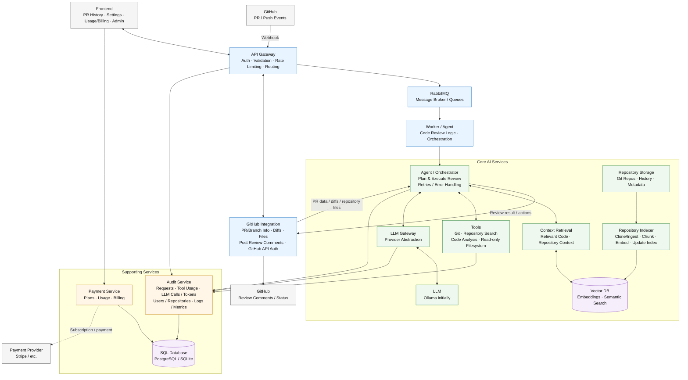

# 1. Git ИИ Ревьюер кода — POC 




# 1. Общая архитектура системы (Компоненты и границы ответственности)

Система построена на микросервисной архитектуре, ориентированной на события (Event-Driven Architecture), и включает в себя следующие основные блоки:

## 1.1 Границы ответственности

- **Frontend (FE)**: Пользовательский интерфейс для управления настройками репозиториев, просмотра истории PR, администрирования и управления биллингом (Payment Provider).
- **Backend (Core Execution & Routing)**:
    - **API Gateway (APIGW)**: Единая точка входа для вебхуков от GitHub/GitLab (Push/PR events), маршрутизация запросов от Frontend, валидация, rate limiting и авторизация.
    - **RabbitMQ (MQ)**: Брокер сообщений для асинхронного управления очередью задач по ревью кода.
    - **Worker / Agent**: Выполняет бизнес-логику ревью, забирает задачи из очереди и координирует работу внутренних модулей.
    - **GitHub Integration (GHI)**: Инкапсуляция логики взаимодействия с GitHub API (получение файлов, диффов, отправка комментариев и статусов).
- **Core AI Services (ИИ-ядро)**:
    - **Agent / Orchestrator (ORCH)**: Основной планировщик задач ревью, управляющий обработкой ошибок и вызовом нужных инструментов.
    - **Context Retrieval (CR) & Repository Indexer (IDX)**: Компоненты для подготовки и семантического поиска релевантного кода (с использованием Vector DB) по всему репозиторию.
    - **LLM Gateway (LGW) & LLM**: Абстракция над провайдерами нейросетей (изначально Ollama), обеспечивающая балансировку и маршрутизацию запросов к большим языковым моделям.
    - **Tools**: Набор утилит для поиска по репозиторию, анализа кода, работы с Git в read-only песочнице (filesystem).
- **Supporting Services (Поддерживающие сервисы)**:
    - **Audit Service (AUD)**: Логирование расхода токенов, вызовов LLM, истории использования инструментов. Сохраняет данные в SQL-базу.
    - **Payment Service (PAY)**: Учет тарифных планов и подписок.

## 2. Потоки данных (Data Flows)

1.  **Инициация**: При создании Pull Request или Push-событии GitHub отправляет вебхук в API Gateway.
2.  **Очередь**: API Gateway валидирует payload и публикует сообщение в очередь RabbitMQ для асинхронной обработки.
3.  **Оркестрация и Данные**: Agent/Worker вычитывает задачу и передает управление в Orchestrator. Оркестратор через GitHub Integration скачивает данные о Pull Request и измененных файлах.
4.  **Сбор контекста**: Orchestrator вызывает Context Retrieval и Tools для формирования расширенного контекста вокруг диффа. Если необходим поиск похожих фрагментов кода, Context Retrieval выполняет запрос к Vector DB.
5.  **Генерация ответа**: Оркестратор отправляет собранный контекст и системные промпты в LLM через LLM Gateway.
6.  **Публикация результатов**: Полученные от LLM замечания оркестратор отдает в GitHub Integration, который публикует Review Comments в PR на GitHub.
7.  **Аудит и метрики**: Параллельно LLM Gateway, Tools и Orchestrator отправляют телеметрию в Audit Service для списания токенов и сбора аналитики (сохраняется в SQL Database).

## 3. Правила взаимодействия с VCS, форматы очередей и кэширование

### 3.1 Взаимодействие с VCS (GitHub API)
- **Аутентификация**: Выполняется посредством GitHub Apps для получения краткосрочных installation access токенов.
- **Rate Limits & Fallbacks**: GHI обязан отслеживать заголовки лимитов API. При достижении лимитов оркестратор должен применять паттерн Exponential Backoff.

### 3.2 Формат очереди задач (RabbitMQ)  - TBD, Placeholder
В брокере сообщений используется JSON-структура. Очереди разделены на приоритетные (для платных пользователей, PAY service) и стандартные.

```json
{
  "job_id": "uuid-1234",
  "event_type": "pull_request",
  "action": "opened",
  "repository": {
    "full_name": "owner/repo",
    "id": 987654
  },
  "pull_request": {
    "number": 42,
    "head_sha": "abc123def",
    "base_sha": "fed654cba"
  },
  "routing_key": "premium_tier"
}
```

### 3.3 Стратегия кэширования контекстов -- TBD

*   **AST и Векторы:** Repository Indexer асинхронно обновляет векторы (Embeddings) в Vector DB при слиянии кода в основную ветку.
*   **Кэш Файлов:** Извлеченные репозитории кэшируются в Repository Storage.
*   **LLM Cache:** LLM Gateway может кэшировать идентичные запросы (семантический кэш) для снижения задержек и экономии токенов.

---

### 4. Концепция сборщика контекста (Context Assembly) --TBD

Для соблюдения лимитов токенов `Context Retrieval` передает LLM данные в иерархическом порядке:

*   **Diff (Уровень изменений):**
    *   **Данные:** Стандартный unified diff (+ добавленные, - удаленные строки).
    *   **Цель:** Понимание того, какие конкретно строки были модифицированы в PR.
*   **Surrounding (Окружающий код):**
    *   **Данные:** Измененные функции или блоки классов целиком (расширение контекста на N строк вверх и вниз).
    *   **Цель:** Оценка логики изменения внутри конкретной функции (не нарушен ли цикл, обработка ошибок).
*   **Whole File (Уровень файла):**
    *   **Данные:** Полный текст модифицируемого файла (добавляется, если позволяет лимит окна контекста).
    *   **Цель:** Проверка импортов, глобальных констант и соответствия код-стайлу файла.
*   **AST / Imports (Архитектурный уровень):**
    *   **Данные:** Сигнатуры вызываемых интерфейсов, классов и функций из соседних файлов. Извлекаются через Repository Indexer и Tools.
    *   **Цель:** Выявление сайд-эффектов (например, изменение аргументов функции в файле A, когда она также используется в


## Основной процесс ревью

**GitHub PR → Webhook → API Gateway → RabbitMQ → Agent → Context + LLM → GitHub Review**
