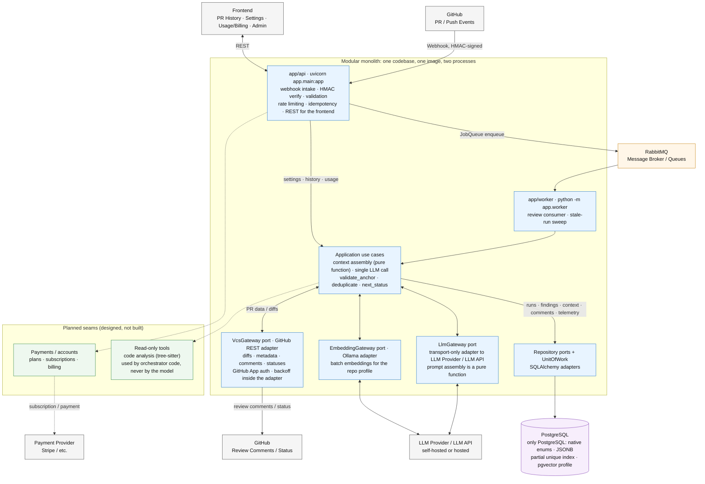

# Git ИИ Ревьюер кода — системный дизайн

Система автоматического ревью кода: отслеживает изменения в pull request'ах, собирает контекст вокруг диффа, передаёт его на ревью LLM и публикует результат обратно в VCS.

> **Разделение ответственности документов.** Этот документ владеет топологией развертывания, layout'ом обменов и очередей RabbitMQ, фронтендом, платежным UX и выбором внешних провайдеров (LLM provider / LLM API). Источник истины по слоям, портам, схеме данных, миграциям и threat model — [BACKEND_ARCHITECTURE.md](BACKEND_ARCHITECTURE.md); по модели данных — [erd.md](erd.md). При расхождении приоритет у BACKEND_ARCHITECTURE.md.

## 1. Диаграмма компонентов



Сплошные узлы и связи — построено. Пунктир — запланированные швы (таблица «Designed, not built» в BACKEND_ARCHITECTURE.md): порт не пишется раньше первого вызова, шов описывается заранее и бесплатно.

## 2. Общая архитектура (компоненты и границы ответственности)

Система — **событийно-ориентированный модульный монолит**: один кодбейс, один образ, два процесса, которые общаются через очередь, а не по HTTP. Это осознанно не микросервисы: микросервисы решают организационную проблему независимых команд, которой здесь нет, а их цену — сетевые вызовы вместо вызовов функций, частичные отказы, версионирование контрактов, идемпотентность на каждой границе — платить нечем. Полное обоснование — раздел «Process shape» в BACKEND_ARCHITECTURE.md.

Границы компонентов ниже — логические (слои `app/api`, `app/application`, `app/domain`, `app/infrastructure`; направление импортов проверяет import-linter в CI), а не деплойментные.

### 2.1 Границы ответственности

- **Frontend (FE)**: настройки репозиториев, история PR, администрирование, usage/billing. Общается с системой только через REST API монолита (`app/api`).
- **`app/api` — HTTP-точка входа (`uvicorn app.main:app`)**: приём вебхуков GitHub/GitLab с проверкой HMAC-подписи, валидация, rate limiting (fixed-window, порт `RateLimiter`), идемпотентность повторных доставок (порт `IdempotencyStore`), REST для фронтенда, постановка задач в очередь (порт `JobQueue`).
- **RabbitMQ**: брокер сообщений; адаптер порта `JobQueue` с единственным методом `enqueue`. Layout обменов — зона ответственности этого документа (см. 4.2).
- **`app/worker` — консьюмер ревью (`python -m app.worker`)**: ходит минутами, ограничен латентностью модели; также выметает зависшие прогоны (`find_stale`, `last_progress_at`).
- **Оркестрация — use cases слоя `application`**: одноходовый сценарий ревью — сборка контекста (чистая функция), один вызов LLM через `LlmGateway`, `validate_anchor` и `deduplicate`, публикация через `VcsGateway`; жизненный цикл прогона — `next_status`. Ретраи с exponential backoff живут в адаптерах. **Модель не получает инструментов и никогда не выбирает действий** — структурная защита от prompt injection (threat model в BACKEND_ARCHITECTURE.md).
- **`VcsGateway` (порт; первый адаптер — GitHub REST)**: диффы (unified diff; каждый hunk несёт ±30 строк контекста вокруг изменения), метаданные, комментарии, статусы; аутентификация GitHub App с краткосрочными installation-токенами; довыборка содержимого файлов по `head_sha` для уровней `whole_file` и `ast` — деталь реализации адаптера, как payload'ы, синтаксис комментариев, auth и backoff.
- **`LlmGateway` (порт)**: транспортный адаптер к **LLM provider / LLM API** (self-hosted или hosted). Сборка промпта — чистая функция; адаптер только транспортирует. Выбор провайдера — конфигурация composition root; конкретный первый адаптер зафиксирован в BACKEND_ARCHITECTURE.md. Переход с self-hosted модели на hosted LLM API — в том числе решение по безопасности (крупнейший путь эксфильтрации), не только операционное.
- **`EmbeddingGateway` (порт; адаптер — Ollama)**: батчевое вложение текстов в векторы для RAG-профиля репозитория; транспортный, как `LlmGateway`. Профиль строится из surrounding-окон уже увиденных прогонов и хранится в той же PostgreSQL (pgvector), без отдельной векторной БД; детали — в BACKEND_ARCHITECTURE.md.
- **Данные и телеметрия**: не отдельный сервис. Стоимость прогона — колонки `model`, `tokens_used`, `duration_seconds`, `failure_reason` в `review_runs`; per-call аудит (вызовы LLM и инструментов) — будущий шов, его первый заказчик — биллинг по токенам.
- **Payments / accounts**: сегодня спроектирована только таблица `accounts` — она придёт вместе со своим портом (регистрация репозитория с проверкой прав на него); тарифы, подписки, Stripe — запланированный шов. Приоритет платных тарифов — требование к обслуживанию очереди (раздел 4.2), код порта оно не затрагивает.
- **Контекст без клона (принцип)**: репозиторий никогда не клонируется целиком и не хранится — Repository Indexer и внешняя Vector DB исключены из дизайна. Весь контекст строится из данных PR через `VcsGateway`: дифф с ±30 строками контекста вокруг изменений, опционально полные тексты изменённых файлов и сигнатуры из файлов, на которые ссылаются импорты (уровень `ast`). Исключение — RAG-профиль репозитория: фрагменты, уже увиденные в прошлых прогонах, накапливаются в той же PostgreSQL (pgvector) и возвращаются уровнем `similar`; это не индекс репозитория — его непройденные участки в системе по-прежнему нигде не лежат. Read-only инструменты остаются запланированным швом — только анализ кода (tree-sitter) над файлами, полученными через `VcsGateway`; используются кодом оркестратора, а не моделью.

## 3. Потоки данных

1. **Инициация**: вебхуки GitHub — события pull request и push — приходят в `app/api`, но прогон создаётся не по факту открытия PR: ревью запускается, когда бота добавили в ревьюеры PR или упомянули в комментарии. Источник прогона фиксируется колонкой `review_runs.trigger_source` (enum `TriggerSource`: `webhook` / `manual` / `mention`).
2. **Подлинность и идемпотентность**: проверяется HMAC-подпись доставки; ключ идемпотентности занимается через `INSERT ... ON CONFLICT DO NOTHING` (порт `IdempotencyStore`), повторная доставка переигрывает исход первой. Схема дополнительно допускает не более одного незавершённого прогона на коммит (partial unique index).
3. **Очередь**: задача публикуется в RabbitMQ через `JobQueue.enqueue`.
4. **Консюмер**: `app/worker` вычитывает сообщение (job); устойчивая сущность — `ReviewRun` (переименована из `ReviewJob`, чтобы строка БД не делила имя с сообщением очереди).
5. **Сбор контекста**: use case иерархически собирает контекст (раздел 5) и сохраняет показанное модели в `context_payloads` — с редакцией секретов до вставки.
6. **Генерация**: один вызов LLM через `LlmGateway`; модель возвращает структурированные findings, а не прозу.
7. **Валидация**: `validate_anchor` отбрасывает замечания вне диффа (отклонения считаются на прогоне), `deduplicate` убирает повторы; переходы статуса — через `next_status`.
8. **Публикация**: `VcsGateway` публикует Review Comments и статусы; каждый опубликованный комментарий фиксируется в `published_comments`.
9. **Телеметрия**: `model`, `tokens_used`, `duration_seconds`, `failure_reason` пишутся в `review_runs`.

## 4. Правила взаимодействия с VCS, форматы очередей и кэширование

### 4.1 Взаимодействие с VCS (GitHub API)

- **Аутентификация**: GitHub Apps — краткосрочные installation access токены; утечка ограничена одной инсталляцией, а не всеми репозиториями владельца токена.
- **Rate Limits & Fallbacks**: адаптер `VcsGateway` отслеживает заголовки лимитов API; exponential backoff при 429/5xx — внутри адаптера.
- **Подлинность вебхуков**: GitHub подписывает доставки HMAC по телу; без проверки любой, кто узнал endpoint, может заставить систему ревьюить что угодно и тратить бюджет модели.

### 4.2 Формат очереди задач (RabbitMQ) 

JSON-сообщение; тело несёт только доменные данные — метаданные доставки (маршрут, приоритет) живут в свойствах AMQP и в тело не дублируются. Очередь одна, с `x-max-priority`. Требование: прогоны платных тарифов обслуживаются раньше бесплатных; в AMQP оно отображается свойством `priority` (0–9), учитываемым среди сообщений, ожидающих в очереди. Как требование выражается в коде — зона ответственности BACKEND_ARCHITECTURE.md: порт `JobQueue` сведён к одному методу `enqueue(job)`, адаптер RabbitMQ выводит приоритет из самого job'а (тариф аккаунта и так в данных, слой `application` про тарифы не знает), поэтому layout обменов и приоритеты кода не затрагивают.

```json
{
  "job_id": "uuid-1234",
  "event_type": "pull_request",
  "action": "opened",
  "repository": {
    "full_name": "owner/repo",
    "id": 987654
  },
  "pull_request": {
    "number": 42,
    "head_sha": "abc123def",
    "base_sha": "fed654cba"
  }
}
```

`job_id` — идентификатор сообщения (UUIDv7, генерируется в домене, не базой); устойчивая строка — `ReviewRun`; дедупликация повторных доставок — `IdempotencyStore`.

### 4.3 Стратегия кэширования

- **CacheStore**: best-effort key/value с TTL; сначала in-process словарь — корректен, пока процесс один, Redis-адаптер появляется вместе со второй репликой. Промах — не ошибка. Семантический кэш LLM-запросов не планируется: ключ точный.
- **Кэш файлов**: диффы и содержимое файлов, полученные через `VcsGateway`, кэшируются в CacheStore по неизменяемым ключам (репозиторий, путь, sha) — содержимое по sha не меняется; промах — не ошибка.

## 5. Концепция сборщика контекста (Context Assembly)

Сборка контекста и промпта — чистая функция (адаптер `LlmGateway` только транспортирует). Репозиторий не клонируется и не хранится: каждый уровень собирается из данных PR и содержимого файлов по `head_sha`, полученных через `VcsGateway`. Уровни записываются в `context_payloads.tiers` (`diff`, `surrounding`, `whole_file`, `ast`, `similar`). Для соблюдения лимитов токенов данные передаются иерархически:

- **Diff (уровень изменений)**
    - **Данные:** стандартный unified diff (+ добавленные, − удалённые строки).
    - **Цель:** понимание того, какие конкретно строки модифицированы в PR.
- **Surrounding (окружающий код)**
    - **Данные:** ровно ±30 строк вокруг каждого изменённого блока — контекстные строки unified diff'а, который возвращает `VcsGateway` (довыборка содержимого файла по `head_sha` — внутри адаптера); перекрывающиеся окна склеиваются чистой функцией сборки.
    - **Цель:** оценка логики изменения внутри конкретной функции (не нарушен ли цикл, обработка ошибок).
- **Whole File (уровень файла)**
    - **Данные:** полный текст модифицируемого файла, полученный через `VcsGateway` по `head_sha` той же довыборкой (добавляется, если позволяет лимит окна контекста).
    - **Цель:** проверка импортов, глобальных констант и соответствия код-стайлу файла.
- **AST / Imports (архитектурный уровень)**
    - **Данные:** сигнатуры вызываемых интерфейсов, классов и функций из соседних файлов. Без клона и индекса: импорты извлекаются из уже полученного текста изменённых файлов, каждый импорт разрешается в путь репозитория, `VcsGateway` довыбирает содержимое этих файлов по `head_sha` (с лимитами на число файлов и байты; неразрешённые импорты пропускаются), tree-sitter извлекает только сигнатуры.
    - **Цель:** выявление сайд-эффектов — например, изменение аргументов функции в файле A, когда она также используется в файле B.
- **Similar (похожий код из профиля репозитория)**
    - **Данные:** top-k чанков RAG-профиля этого репозитория, ближайших к текущим окнам окружения, — код, который ревью уже видело в прошлых прогонах. Поиск — pgvector по вложениям `EmbeddingGateway`, отбор под лимиты (число, байты, отсечение самосовпадений) — чистая функция; чанки идут в контекст как delimited data по тому же контракту, что и дифф.
    - **Цель:** память о репозитории между прогонами — ревью видит, как тот же код устроен в соседних местах, не клонируя и не индексируя репозиторий целиком.

Безопасность и лимиты (угрозы — threat model в BACKEND_ARCHITECTURE.md):

- дифф передаётся модели как delimited data и никогда не конкатенируется в инструкцию — защита от prompt injection через ревьюимый код; чанки уровня `similar` — тот же чужой код, тот же контракт;
- редакция секретов до вставки в `context_payloads` и в чанки профиля — обе таблицы хранят чужой исходный код verbatim;
- жёсткие лимиты на число файлов, байты диффа и довыбираемых файлов, длительность прогона — и дифф, и набор импортируемых файлов могут быть сколь угодно большими.

AST-уровень — первый кандидат на вынос из монолита: если tree-sitter не устроит, выделяется сервис парсинга — один порт получает сетевой адаптер (Strangler Fig), структура кода не меняется.

## 6. Основной процесс ревью

**GitHub PR → Webhook (HMAC) → `app/api` → `IdempotencyStore` → `JobQueue` / RabbitMQ → `app/worker` → Context Assembly → один вызов LLM → validate / dedup → `VcsGateway` → GitHub Review**
