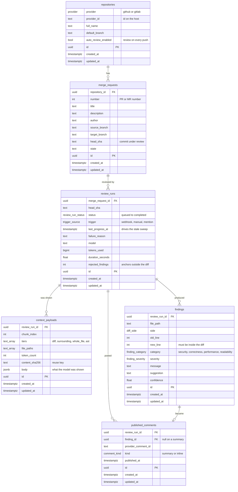

# Data model

Source of truth for the shape of the database. The tables are created by
`alembic/versions/0001_baseline_schema.py`; a test asserts this diagram's
tables and the models do not drift apart.

`ReviewRun` is the ticket's `ReviewJob`. The name changed because "job" is
also going to be the RabbitMQ message, and a durable row sharing a name with a
transient message is how people end up debugging the wrong thing.

## Rules the schema enforces

These are constraints, not conventions, so no code path can forget them.

| Rule | How |
|---|---|
| A repository is one row per host | `UNIQUE (provider, provider_id)`. The same `full_name` on two hosts is two rows. |
| A change request number is unique in its repository | `UNIQUE (repository_id, number)` |
| At most one unfinished run per commit | Partial `UNIQUE (merge_request_id, head_sha) WHERE status NOT IN ('cancelled','completed','failed')`. A finished run does not block a re-review. |
| Context chunks keep their order | `UNIQUE (review_run_id, chunk_index)` |
| A finding cannot repeat in a run | `UNIQUE (review_run_id, file_path, new_line, category)` |
| A finding is published once per run | `UNIQUE (review_run_id, finding_id)` |
| Deleting a repository removes everything under it | `ON DELETE CASCADE` down the chain |

## Two things worth knowing

**The partial index needs a reaper.** Allowing one unfinished run per commit is
what stops a redelivered webhook starting a second review. It also means a
worker that dies mid-run leaves the run non-terminal and blocks that commit
forever. `last_progress_at` and `find_stale` exist for that; the sweep that
uses them lands with the worker.

**`context_payloads` holds other people's source code.** It is the sensitive
table. Secret redaction belongs before the insert, and retention is a
data-protection question as much as a storage one.
