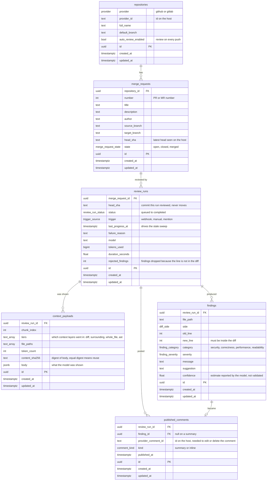

# Data model

Source of truth for the shape of the database. The tables are created by
`alembic/versions/0001_baseline_schema.py`; a test asserts this diagram's
tables and the models do not drift apart.

`ReviewRun` is the ticket's `ReviewJob`. The name changed because "job" is
also going to be the RabbitMQ message, and a durable row sharing a name with a
transient message is how people end up debugging the wrong thing.

## Tables

**`repositories`**: a repository the service may review, one row per host.
Holds the per-repository switch for automatic review.

**`merge_requests`**: a GitHub pull request or GitLab merge request. It holds
what every review of it shares: number, title, branches, author. `head_sha`
here is the latest commit seen on the host and moves with every push. A new
run compares against it to tell whether an earlier run is out of date. `state`
is reduced to three values both hosts can express; the provider adapter
translates GitLab's `locked` and GitHub's closed-and-merged before storing.

**`review_runs`**: one attempt to review one commit of a change request. Its
`head_sha` is the commit that was reviewed and never changes, so history stays
readable after the request moves on. It carries the run through its lifecycle
and keeps the result: failure reason, model, tokens, duration, and how many
findings were thrown away. The name is deliberately not a queue name. The
queue is RabbitMQ and its message is the `ReviewJob`; the row outlives its
moment in the queue by the whole analysis and publication, and owns what they
produce.

**`context_payloads`**: exactly what the model was shown for a run, in order,
one row per chunk when the context does not fit one request. It makes a run
reproducible: a bad finding can be traced to the input that caused it. The
digest lets a later run of identical content reuse it instead of rebuilding.

**`findings`**: what the model reported that survived post-processing: anchored
to a line the diff touched, deduplicated, categorised. A finding exists whether
or not it is published, which is why it is separate from the next table.

**`published_comments`**: what was actually posted to the host, and the host's
id for it. Without that id the service cannot later edit or remove its own
comment. An inline comment points at its finding; the run's summary points at
none.

## Rules the schema enforces

These are constraints, not conventions, so no code path can forget them.

| Rule | How |
|---|---|
| A repository is one row per host | `UNIQUE (provider, provider_id)`. The same `full_name` on two hosts is two rows. |
| A change request number is unique in its repository | `UNIQUE (repository_id, number)` |
| At most one unfinished run per commit | Partial `UNIQUE (merge_request_id, head_sha) WHERE status NOT IN ('cancelled','completed','failed')`. A finished run does not block a re-review. |
| Context chunks keep their order | `UNIQUE (review_run_id, chunk_index)` |
| A finding cannot repeat in a run | `UNIQUE NULLS NOT DISTINCT (review_run_id, file_path, side, old_line, new_line, category)`. An anchor populates only the line number belonging to its side, so the key carries both and treats NULLs as equal. Without either half the constraint never fires on the old side, where `new_line` is always NULL. |
| A comment is published once per run | `UNIQUE NULLS NOT DISTINCT (review_run_id, finding_id)`. The NULL rule is what extends the limit to the run's summary, which carries no finding. |
| Deleting a row never removes its dependants | `ON DELETE RESTRICT` on every foreign key. A delete that would orphan something is refused, so a posted comment's `provider_comment_id` and a run's cost cannot disappear as a side effect. Cleanup, when it exists, deletes children explicitly. |

## Two things worth knowing

**The partial index needs a reaper.** Allowing one unfinished run per commit is
what stops a redelivered webhook starting a second review. It also means a
worker that dies mid-run leaves the run non-terminal and blocks that commit
forever. `last_progress_at` and `find_stale` exist for that; the sweep that
uses them lands with the worker.

**`context_payloads` holds other people's source code.** It is the sensitive
table. Secret redaction belongs before the insert, and retention is a
data-protection question as much as a storage one.
