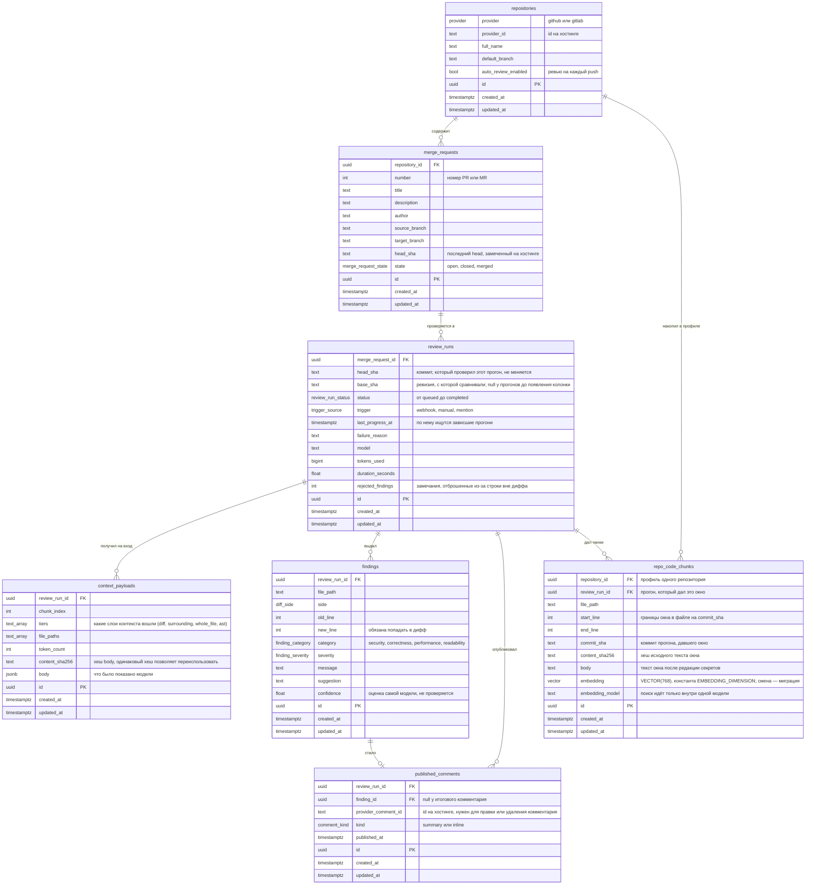

# Модель данных

Источник истины о структуре базы данных. Таблицы создаются миграцией
`alembic/versions/0001_baseline_schema.py`; отдельный тест следит, чтобы таблицы
на этой диаграмме и модели не расходились.

`ReviewRun` в тикете называется `ReviewJob`. Имя поменяли, потому что «job»
будет называться и сообщение в RabbitMQ, а когда долгоживущая строка в базе и
короткоживущее сообщение носят одно имя, люди в итоге отлаживают не то.

## Таблицы

**`repositories`**: репозиторий, который сервису разрешено ревьюить, одна строка
на хостинг. Здесь же лежит переключатель автоматического ревью для репозитория.

**`merge_requests`**: pull request в GitHub или merge request в GitLab. Хранит
то, что общее для всех его ревью: номер, заголовок, ветки, автора. `head_sha`
здесь означает последний коммит, замеченный на хостинге, и сдвигается с каждым
push. Новый прогон сверяется с ним, чтобы понять, устарел ли предыдущий.
`state` сведён к трём значениям, которые умеют выразить оба хостинга; адаптер
провайдера приводит `locked` из GitLab и closed-and-merged из GitHub к ним ещё
до записи.

**`review_runs`**: одна попытка проверить один коммит запроса на изменения. Его
`head_sha` указывает на проверенный коммит и никогда не меняется, поэтому
история остаётся понятной и после того, как запрос ушёл вперёд. `base_sha`
хранит вторую половину той же пары — ревизию, относительно которой считался
дифф: без неё по одному `head_sha` нельзя повторить тот же дифф, если целевая
ветка с тех пор сдвинулась. Строка ведёт
прогон по его жизненному циклу и хранит результат: причину сбоя, модель,
токены, длительность и количество отброшенных замечаний. Имя намеренно не
совпадает с названием из очереди. Очередь живёт в RabbitMQ, и сообщение в ней
называется `ReviewJob`; строка живёт дольше своего сообщения в очереди на всё
время анализа и публикации и владеет их результатами.

**`context_payloads`**: ровно то, что было показано модели в рамках прогона, по
порядку, по строке на чанк, если контекст не влезает в один запрос. Благодаря
этому прогон воспроизводим: неудачное замечание можно отследить до входных
данных, которые его породили. По хешу следующий прогон с тем же содержимым
может переиспользовать payload, а не собирать его заново.

**`findings`**: те замечания модели, что пережили постобработку: привязаны к
строке, которую затронул дифф, без дубликатов, разложены по категориям.
Замечание существует независимо от того, опубликовано оно или нет, поэтому оно
вынесено отдельно от следующей таблицы.

**`published_comments`**: то, что реально опубликовано на хостинге, и id,
который хостинг ему присвоил. Без этого id сервис не сможет потом отредактировать
или удалить собственный комментарий. Inline-комментарий ссылается на своё
замечание, итоговый комментарий прогона ни на что не ссылается.

**`repo_code_chunks`**: RAG-профиль репозитория — код, который ревью уже
видело в окнах окружения прошлых прогонов (таблицу создаёт миграция
`0003_repo_code_chunks.py` вместе с расширением `pgvector`). Чанк хранит окно
целиком: путь, границы, коммит прогона, давшего окно, текст после редакции
секретов, вектор и модель вложений. `UNIQUE (repository_id, content_sha256)`
делает накопление идемпотентным: тот же код из повторного прогона не задвоится.
Профиль — улучшение, а не зависимость: ревью выполняется и по пустому профилю.

## Правила, которые обеспечивает схема

Это ограничения, а не соглашения, поэтому ни один путь в коде не сможет о них
забыть.

| Правило | Как |
|---|---|
| Репозиторий хранится одной строкой на хостинг | `UNIQUE (provider, provider_id)`. Один и тот же `full_name` на двух хостингах даёт две строки. |
| Номер запроса на изменения уникален в пределах репозитория | `UNIQUE (repository_id, number)` |
| Не больше одного незавершённого прогона на коммит | Частичный `UNIQUE (merge_request_id, head_sha) WHERE status NOT IN ('cancelled','completed','failed')`. Завершённый прогон не мешает повторному ревью. |
| Чанки контекста сохраняют порядок | `UNIQUE (review_run_id, chunk_index)` |
| Замечание не может повториться в одном прогоне | `UNIQUE NULLS NOT DISTINCT (review_run_id, file_path, side, old_line, new_line, category)`. Привязка заполняет только номер строки своей стороны, поэтому в ключе есть оба номера, а NULL считаются равными. Без любой из этих двух частей ограничение никогда не сработает на старой стороне, где `new_line` всегда NULL. |
| Комментарий публикуется один раз за прогон | `UNIQUE NULLS NOT DISTINCT (review_run_id, finding_id)`. Именно правило для NULL распространяет это ограничение на итоговый комментарий прогона, у которого замечания нет. |
| Накопление профиля идемпотентно | `UNIQUE (repository_id, content_sha256)` на `repo_code_chunks`: повторный прогон того же кода не создаёт второй чанк, вставка — `ON CONFLICT DO NOTHING`. |
| Поиск по профилю не смешивает модели вложений | У чанка хранится `embedding_model`; поиск фильтрует по ней — после смены модели старые чанки не участвуют, пока не перевложены. |
| Удаление строки никогда не удаляет зависимые | `ON DELETE RESTRICT` на каждом внешнем ключе. Удаление, после которого что-то осталось бы без родителя, отклоняется, так что `provider_comment_id` опубликованного комментария и стоимость прогона не пропадут побочным эффектом. Очистка, когда она появится, удаляет дочерние строки явно. |

## Две вещи, которые стоит знать

**Частичному индексу нужен сборщик зависших прогонов.** Ограничение в один
незавершённый прогон на коммит не даёт повторно доставленному вебхуку запустить
второе ревью. Но из-за него же воркер, упавший посреди прогона, оставляет прогон
в нетерминальном статусе и навсегда блокирует этот коммит. Для этого и
существуют `last_progress_at` и `find_stale`; проход, который их использует,
появится вместе с воркером.

**В `context_payloads` лежит чужой исходный код.** Это чувствительная таблица.
Вычищать секреты нужно до вставки, а срок хранения здесь такой же вопрос защиты
данных, как и вопрос места на диске. То же верно для `repo_code_chunks`: тело
чанка проходит ту же редакцию (`redact`) в шве репозитория профиля.
